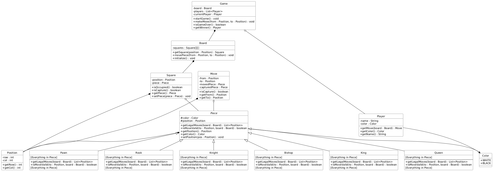

# Chess Game Design

## 1. Functional and Non-Functional Requirements

### Functional Requirements:

The system must:
- render an 8×8 chessboard.
- alternate turns between the two players (white and black).
- allow each piece to move according to the official chess rules.
- validate move legality and reject illegal moves.
- detect game-ending conditions (checkmate, stalemate, or draw).
- determine and announce the winner or a draw.
- provide the ability to start a new game.

### Non-Functional Requirements:

The system should:
- provide a user-friendly graphical interface for making moves and viewing the board.
- display visual indicators for legal moves, checks, and checkmates.
- respond to user actions (e.g. move selection) within 100 milliseconds.

---

## 2. Use Cases

**Title:** Start Game

**Primary Actor:** Player

**Success Scenario:** 

**1** Player launches the chess application.

**2** System initializes the game board with pieces in starting positions.

**3** System sets the current turn to Player. 

**4** System displays the board to the player.

**Title:** Make Move

**Primary Actor:** Player

**Success Scenario:** 

**1** Player selects a piece and a target square. 

**2** System highlights valid moves.

**3** Player confirms the move.

**4** System updates the board, moves the piece, and switches the turn to the other player.

**Title:** Validate Move

**Primary Actor:** Player

**Success Scenario:** 

**1** Player attempts a move. System checks if the move is valid based on piece type and game rules. 

**2** If valid, the move proceeds. If not, system notifies player and rejects move.

**Title:** Check Game Over

**Primary Actor:** Player

**Success Scenario:** 

**1** After each move, system evaluates the board state. 

**2** System checks for checkmate, stalemate, or draw conditions. 

**3** If the game is over, system displays result to players.

**Title:** Get Winner

**Primary Actor:** Player

**Success Scenario:** 

**1** At end of game, system determines if one player has checkmated the other or if the game is a draw. 

**2** System displays the winner or draw result.

**Title:**: Display Board

**Primary Actor:** Player

**Success Scenario:** 

**1** System continuously displays the current board state after each move.

**2** System highlights possible moves when a piece is selected and updates the display accordingly.

---

## 3. CRC Cards

| Class      | Responsibilities                                                                                                          | Collaborators           |
| ---------- | ------------------------------------------------------------------------------------------------------------------------- | ----------------------- |
| **Game**   | - Manage game turns <br> - Start and initialize the game <br> - Check if game over <br> - Determine winner                | Board, Player, Move     |
| **Board**  | - Store squares state <br> - Initialize board with pieces <br> - Process piece moves                                       | Square, Piece, Position |
| **Player** | - Make moves <br> - Store player name and color                                                                            | Game, Board             |
| **Square** | - Store position <br> - Hold piece if any <br> - Check occupancy                                                           | Piece, Position         |
| **Piece**  | - Store color and position <br> - Determine legal moves <br> - Validate moves                                              | Board, Position, Color  |
| **Move**   | - Store from/to positions <br> - Store moved and captured piece <br> - Check if capture                                    | Piece, Position         |

---

## 4. Class Diagram (UML)



---

## 5. Java Code

```java
public enum Color {
    WHITE,
    BLACK
}

public class Position {
    private int row;
    private int col;

    public Position(int row, int col) {
        this.row = row;
        this.col = col;
    }

    public int getRow() { return row; }
    public int getCol() { return col; }
}

public abstract class Piece {
    protected Color color;
    protected Position position;

    public Piece(Color color, Position position) {
        this.color = color;
        this.position = position;
    }

    public abstract List<Position> getLegalMoves(Board board);
    public abstract boolean isMoveValid(Position to, Board board);

    public Position getPosition() { return position; }
    public Color getColor() { return color; }
    public void setPosition(Position pos) { this.position = pos; }
}

public class Pawn extends Piece {
    public Pawn(Color color, Position position) {
        super(color, position);
    }

    @Override
    public List<Position> getLegalMoves(Board board) {
        // implementation omitted
        return new ArrayList<>();
    }

    @Override
    public boolean isMoveValid(Position to, Board board) {
        // implementation omitted
        return false;
    }
}

// Continue similarly with Rook, Knight, Bishop, Queen, King...

public class Square {
    private Position position;
    private Piece piece;

    public boolean isOccupied() { return piece != null; }
    public boolean isCapture() { return isOccupied(); }
    public Piece getPiece() { return piece; }
    public void setPiece(Piece piece) { this.piece = piece; }
}

public class Move {
    private Position from;
    private Position to;
    private Piece movedPiece;
    private Piece capturedPiece;

    public boolean isCapture() { return capturedPiece != null; }
    public Position getFrom() { return from; }
    public Position getTo() { return to; }
}

public class Player {
    private String name;
    private Color color;

    public Player(String name, Color color) {
        this.name = name;
        this.color = color;
    }

    public Move getMove(Board board) {
        // implementation omitted
        return null;
    }

    public Color getColor() { return color; }
    public String getName() { return name; }
}

public class Board {
    private Square[][] squares = new Square[8][8];

    public void initialize() {
        // setup pieces
    }

    public Square getSquare(Position position) {
        return squares[position.getRow()][position.getCol()];
    }

    public void movePiece(Position from, Position to) {
        // implementation omitted
    }
}

public class Game {
    private Board board;
    private List<Player> players;
    private Player currentPlayer;

    public void startGame() {
        board = new Board();
        board.initialize();
        // initialize players
    }

    public void makeMove(Position from, Position to) {
        // logic to make move
    }

    public boolean isGameOver() {
        // check for mate/stalemate/draw
        return false;
    }

    public Player getWinner() {
        // determine winner
        return null;
    }
}
```

---
